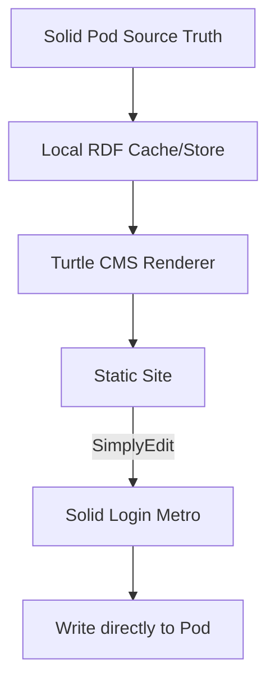

# TurtleCMS
Solid Turtle CMS, to turn your solid pod into a website.

#design

#Todo
* Metro JS:
    ** [ ] get everything.js from https://github.com/muze-nl/metro/tree/copilot/monorepofix-tests-workflow/dist
    ** [ ] login to pod in the websites/-name-website- folder
    ** [ ] retrieve all files and copy to the local (web) server
    ** [ ] subscribe to the files to update them if they're changed

* "translation" file format
    ** have several .ttl files to generate pages on the website.
      *** using schema.org there will probably be 3 files
      **** [ ] content ( text ) and where it's placed on the website and in what format
      **** [ ] formats and how they're translated to html web elements
      **** [ ] formats and how they're styled 

* Simply edit/things
    ** log into the website(pod)
    ** make changes to the page by actually editing the .ttl files on the pod

#LICENSE
EUPL by Govert Combée
