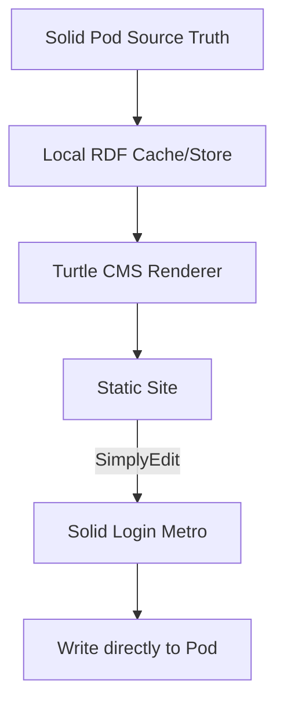

# TurtleCMS
Solid Turtle CMS, to turn your solid pod into a website.

#design

```mermaid
flowchart TD
    A["Solid Pod Source Truth"] --> B["Local RDF Cache/Store"]
    B --> C["Turtle CMS Renderer"]
    C --> D["Static Site"]
    D -->|SimplyEdit| E["Solid Login Metro"]
    E --> F["Write directly to Pod"]
```

#LICENSE
EUPL by Govert Combée
